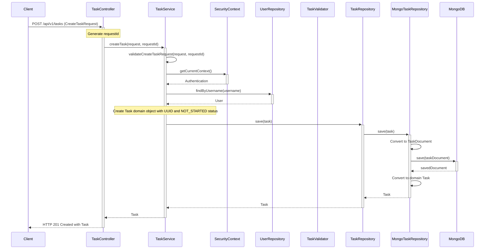

# Task Creation Sequence Diagram

This diagram illustrates the sequence flow when creating a new task in the Task Manager application.

## Task Creation Flow Explanation

1. **Client Request**:
   - The client sends a POST request to `/api/v1/tasks` with a `CreateTaskRequest` body
   - The request contains task name, description, due date, priority, tags, and user

2. **Controller Processing**:
   - `TaskController` receives the request and generates a unique request ID for tracking
   - The controller delegates to the service layer for business logic

3. **Service Layer**:
   - `TaskService` validates the incoming request (name, priority, tags, etc.)
   - Retrieves the current user ID from the security context for ownership assignment
   - Creates a new Task domain object with a generated UUID and NOT_STARTED status

4. **Persistence Layer**:
   - The task is passed to the repository layer for persistence
   - `MongoTaskRepository` converts the domain Task to a TaskDocument
   - The document is saved to MongoDB
   - The saved document is converted back to a domain Task object

5. **Response**:
   - The saved Task is returned to the controller
   - The controller returns an HTTP 201 Created response with the Task in the body

This sequence demonstrates the clean separation between controller, service, and repository layers, adhering to good architectural practices. The use of domain objects and DTOs for data transfer between layers provides clear boundaries and promotes a well-structured system.